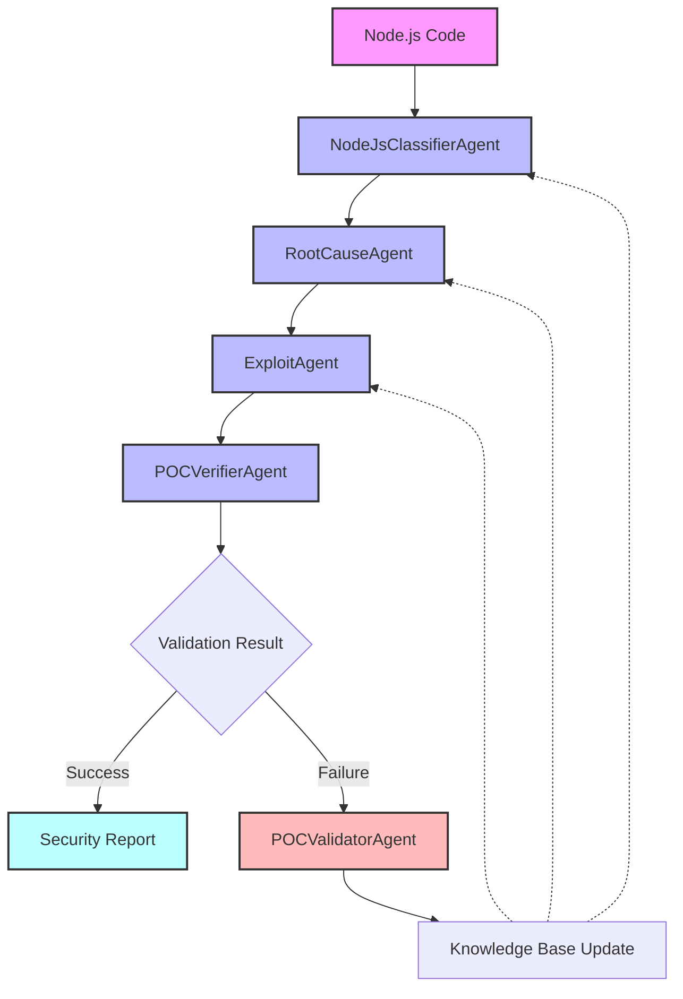
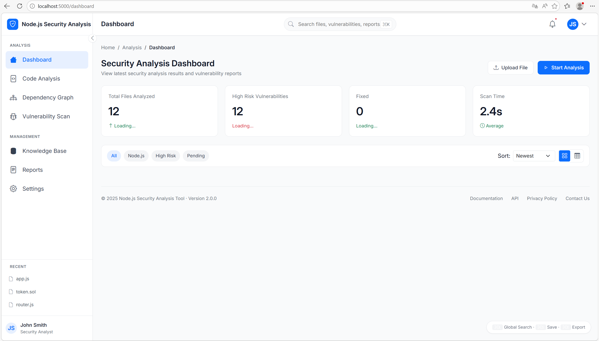
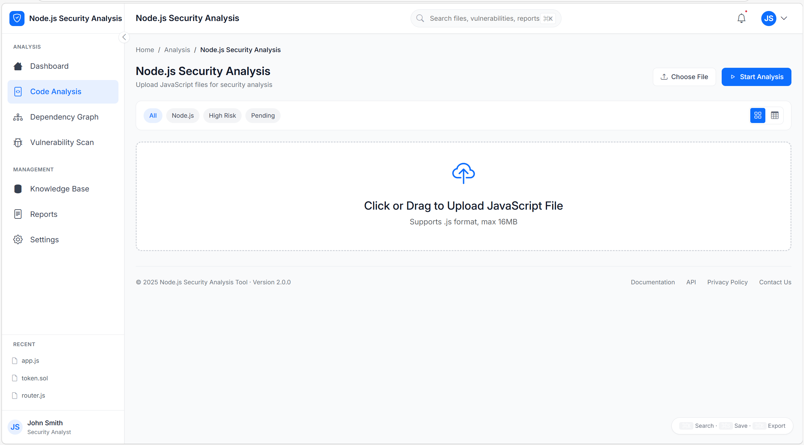
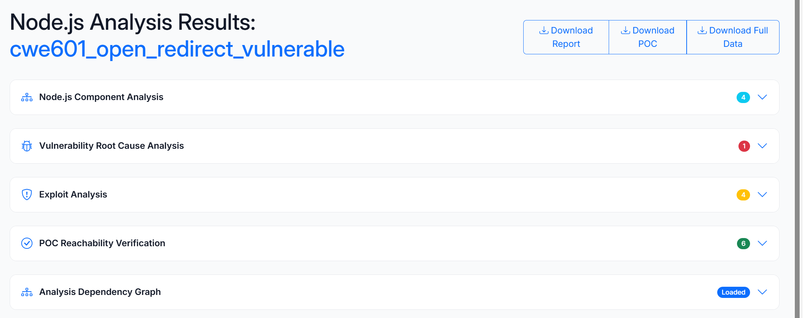
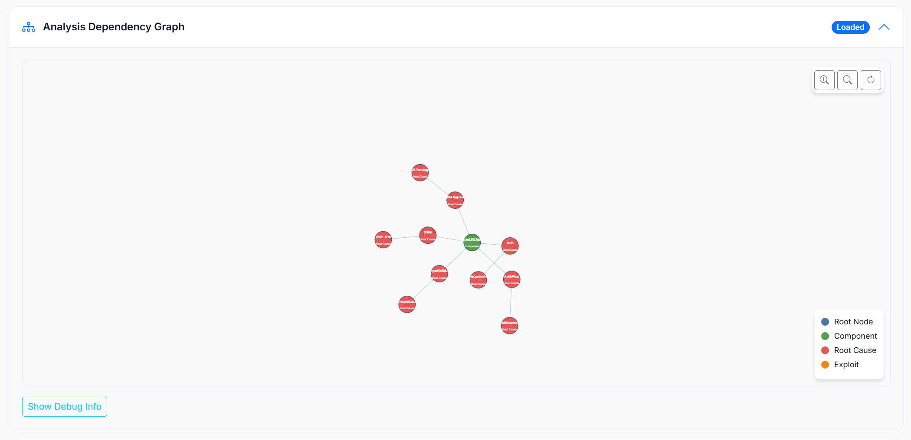
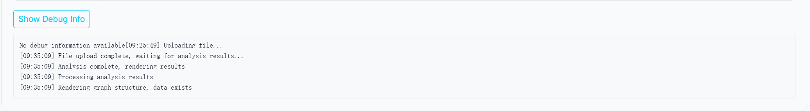

# 🛡️ Node.js Security Analysis System

### *A Knowledge-Driven Agentic System for End-to-End Node.js Vulnerability Detection and Exploit Generation*

> **end-to-end vulnerability detection → root cause analysis → exploit reasoning → PoC generation → reachability verification**

---

## 🎬 Demo: Real-World Vulnerability Analysis

> 📹 **Demo Video**: A demonstration video is available. Please contact the maintainer or check the project documentation.

> 💡 **Try it yourself!** Launch the Web UI with `python app.py` and experience the interactive analysis interface.

---

## Table of Contents

- [Project Overview](#-project-overview)
- [Core Capabilities](#-core-capabilities)
- [System Architecture](#-system-architecture)
- [Usage Modes](#-usage-modes)
  - [Full Analysis Mode](#full-analysis-mode)
  - [Knowledge Base Evolution Mode](#knowledge-base-evolution-mode)
- [Directory Structure](#-directory-structure)
- [Dependencies](#-dependencies)
- [Quick Start](#-quick-start)
  - [Option 1: CLI](#option-1-cli)
  - [Option 2: Web UI](#option-2-web-ui)
  - [Option 3: Library Usage](#option-3-library-usage)
- [Output Description](#-output-description)
- [Notes](#-notes)

---

## 📖 Project Overview

This system performs **end-to-end Node.js security analysis and PoC generation**, integrating multiple AI agents and RAG (Retrieval-Augmented Generation) technologies.

| Capability | Description |
|------------|-------------|
| 🔍 **Component Classification** | Identifies Node.js components and libraries using hierarchical knowledge graph |
| 🎯 **Root Cause Analysis** | Uses RAG + LLM to infer vulnerability types and trigger conditions |
| ⚔️ **Exploit Reasoning** | Generates attack vectors and step-by-step exploit plans |
| ✅ **PoC Generation** | Produces executable Jest-based exploit PoC code |
| 🔄 **Reachability Verification** | Simulates execution to verify vulnerability trigger conditions |

---

## 🧠 System Architecture

The system employs a multi-agent architecture:



### Agent Responsibilities

| Agent | Responsibility |
|-------|----------------|
| **NodeJsClassifierAgent** | Classifies code components and extracts vulnerability keywords |
| **RootCauseAgent** | Analyzes root causes and identifies vulnerability patterns |
| **ExploitAgent** | Generates exploit steps and PoC code |
| **POCVerifierAgent** | Validates PoC reachability through execution simulation |
| **POCValidatorAgent** | Validates PoC against identified vulnerabilities |

---

## 🧠 Usage Modes

### Full Analysis Mode

> End-to-end vulnerability discovery and exploit generation

Upload JavaScript file(s) → 
→ component classification
→ root cause analysis
→ exploit reasoning
→ PoC generation
→ reachability verification
→ security report output

---

## 📁 Directory Structure

```text
NodeJsPOC/
├── app.py                     # Flask web application
├── config.py                  # Global configuration
├── main.py                    # Main orchestration
├── ExploitBehaviortree.json   # Exploit behavior tree
├── requirements.txt           # Python dependencies
├── README.md                  # This file
│
├── agents/                    # AI agent modules
│   ├── exploit_agent.py
│   ├── nodeJs_cla_agent.py
│   ├── poc_validator_agent.py
│   ├── rootcause_agent.py
│   └── verifier_agent.py
│
├── rag/                       # Retrieval-Augmented Generation
│   ├── rag_manager.py
│   └── vector_store.py
│
├── utils/                     # Utility functions
│   ├── file_utils.py
│   └── json_utils.py
│
├── knowledge/                 # Knowledge base source files
│   ├── ExploitBehavior/
│   ├── NodeJs_types/
│   └── rootcause/
│
├── vectorstore/               # FAISS vector store cache
│   ├── NodeJs/
│   ├── exploit/
│   └── rootcause/
│
├── js_examples/               # Example vulnerable JavaScript files
│   ├── mcpjam_inspector/
│   ├── veramo/
│   └── ... (other examples)
│
├── static/                    # Web static files
│   ├── css/
│   └── js/
│
├── templates/                 # HTML templates
│   ├── analyzer.html
│   └── dashboard.html
│
├── result/                    # Analysis results output
├── uploads/                   # Temporary file uploads
├── logs/                      # Application logs
└── demo/                      # Demo assets
```

---

## 📦 Dependencies

### Environment

| Item | Description |
|------|-------------|
| 🐍 Python | 3.9+ |
| 🔑 API Key | OpenAI compatible LLM & embedding API |

### Core Libraries

| Library | Purpose |
|---------|---------|
| langchain | LLM orchestration framework |
| langchain-openai | OpenAI integration |
| faiss-cpu | Vector similarity search |
| flask | Web application framework |
| openai | OpenAI API client |
| d3.js | Graph visualization (frontend) |

### Install

```bash
# Create virtual environment
python -m venv venv_secure
source venv_secure/bin/activate  # On Windows: venv_secure\Scripts\activate

# Install dependencies
pip install -r requirements.txt
```

### Environment Variables

Set your OpenAI API key:

```bash
# Windows PowerShell
$env:OPENAI_API_KEY = "your-api-key-here"

# Linux/Mac
export OPENAI_API_KEY="your-api-key-here"
```

---

## 🚀 Quick Start

### Option 1: CLI

```bash
python main.py [path_to_js_directory]
```

If no directory specified, defaults to:
```text
js_examples/mcpjam_inspector/
```

### Option 2: Web UI

```bash
python app.py
```

Access the web interface at [http://localhost:5000](http://localhost:5000)

#### 🖥️ Web Interface Overview

##### **Main Analysis Dashboard**

The dashboard provides a comprehensive view of all analyses:



##### **File Upload Interface**

Upload JavaScript files for analysis:



##### **Analysis Results**

View detailed analysis results across multiple dimensions:

- **Node.js Component Analysis**: Identified components and extracted keywords
- **Root Cause Analysis**: Vulnerability patterns and trigger conditions
- **Exploit Analysis**: Selected attack steps and generated PoC
- **POC Verification**: Execution trace and reachability validation



##### **Knowledge Graph Visualization**

Interactive force-directed graph showing relationships between:
- **Component Nodes**: Node.js libraries and types (blue/green)
- **Root Cause Nodes**: Vulnerability patterns (red)
- **Exploit Nodes**: Attack steps (orange)



Zoom and pan controls allow detailed exploration of the dependency graph.

##### **Debug Information**

Expandable debug panel shows detailed execution logs:



### Option 3: Library Usage

```python
from main import analyze_js_from_content

# Analyze JavaScript code
js_code = """
const express = require('express');
const app = express();
app.get('/user/:id', (req, res) => {
    const userId = req.params.id;
    // Vulnerable code...
});
"""

result = analyze_js_from_content(js_code, "example.js")
print(result["rootcause_analysis"]["final_vulnerability"])
```

---

## 📄 Output Description

### File Outputs

| File | Description |
|------|-------------|
| `full_analysis.json` | Complete structured analysis results |
| `security_report.md` | Human-readable security report |
| `exploit_poc.js` | Generated exploit PoC code (if applicable) |

### JSON Result Structure

```json
{
  "nodejs_analysis": {
    "analysis": {
      "summary": "",
      "NodeJsType_keywords": []
    },
    "retriever_NodeJs": [...Name:OpencodeUnAuthRCE...]
  },
  "rootcause_analysis": {
    "retrieved_rootcauses": [...Remote Code Execution...],
    "final_vulnerability": {
      "vulnerability_name": "OpenRedirect",
      "reason": "Based on comprehensive ...",
      "code_snippet":,
      "location": ,
      "trigger_point":,
      "confidence_level":,
      "supporting_evidence": 
    },
    "summar":
  },
  "exploit_analysis": {
    "step_selection": {
      "selected_steps": [],
      "exploit_summary": 
    },
    "retrieved_detailed_steps": [],
    "poc_generation": 
  },
  "poc_reachability_report": {
    "environment_analysis": {
      "packages_used": [],
      "initial_state": ,
      "file_structure": 
    },
    "execution_trace": [
      {
        "step": 1,
        "operation": ,
        "parameters": ,
        "expected_result":
      },
      {
        "step": 2,
        "operation": ,
        "parameters":
      },
    ...
    ],
    "vulnerability_trigger_check": {
    },
    "system_interaction_analysis": {
    },
    "vulnerability_triggered": true,
    "reasoning_summary": ,
    "recommendations": [
]
  },
  "graph_data": {
    "visualization_data": {
      "nodes": [
        {
          "id": ,
          "name": ,
          "type": ,
          "description": 
        },
        {
          "id": "PhishingAttack",
          ...
      ],
      "edges": [
        {
          "source":,
          "target":
        },
        {
          "source": "Java_OpenRedirect",
          "target": "CredentialHarvesting"
        },
        {
          "source": "Java_OpenRedirect",
        ...
      ]
    }
  }
}
```

### Security Report (Markdown)

The generated `security_report.md` includes:
- Executive summary
- Vulnerability details with code snippets
- Root cause analysis
- Exploit steps and PoC
- Reachability verification results
- Remediation recommendations

---

## ⚠️ Notes

### Vector Store Requirements

The system operates in **pure vector store mode** and requires pre-built FAISS indices:

```text
vectorstore/
├── NodeJs/          # Node.js component embeddings
├── rootcause/       # Root cause embeddings
└── exploit/         # Exploit step embeddings
```

If these are missing, you'll need to:
1. Temporarily restore knowledge base file configuration
2. Run the system once to build the cache
3. Then switch back to pure vector store mode

### API Key

The system requires a valid OpenAI-compatible API key for LLM and embedding services. Set the `OPENAI_API_KEY` environment variable before running.

### File Size Limit

Web uploads are limited to **16MB** per file.

### Language Support

All system outputs, logs, and LLM interactions are in **English** for consistency and broader accessibility.

### Multi-file Analysis

For complex projects with multiple JavaScript files, all files will be concatenated and analyzed together.

**Built with ❤️ for Node.js security research**